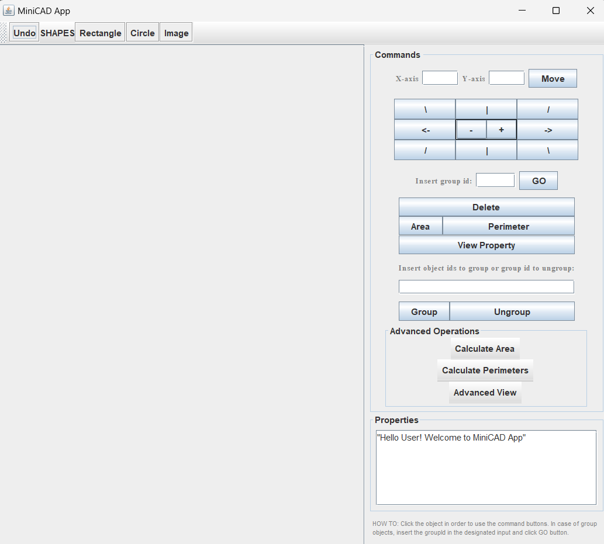

# MiniCAD

## Descrizione
Scopo del progetto è la realizzazione di un mini interprete di comandi da integrare nell'applicazione per la manipolazione di oggetti grafici bidimensionali vista a lezione. Ai fini del progetto, si assume che esistono solo i tre tipi di oggetti grafici già realizzati: rettangoli, cerchi ed immagini.


----------------------------------------------------------------------------
## TABLE OF CONTENTS
- [Requisiti](#requisiti)
- [Installazione](#installazione)
- [MiniCAD GUI](#minicad-gui)
- [Struttura del Codice](#struttura-del-codice)
- [Testing](#testing)

-------------------------------------------------------------------------------------

## Requisiti
- JAVA21

## Installazione
1. Verificare di avere installato Java 21.
2. Clonare il repository : https://github.com/jhenals/Project_IS_MiniCAD.git
3. Navigare nella directory del progetto:
   ```d .../Project_IS_MiniCAD```
4. Eseguire il main : ```src/main/java/MiniCAD/ui/MiniCadGUI.java```

## MiniCAD GUI


## Struttura del Codice
* **MiniCAD/ui/MiniCadGUI.java** - contiene la classe principale MiniCADUI che avvia l'applicazione e gestisce l'interfaccia utente.
* **MiniCAD/miniinterpeter/specificCmds/commandsExpr** - contiene le espressioni Non Terminale per i comandi.
* **MiniCAD/miniinterpeter/specificCmds/lexerparser** - contiene le classi Lexer e Parser 
* **MiniCAD/miniinterpeter/specificCmds/utilExpr** - contiene le espressioni Non Terminale per le classi utilizzati dai comandi nonché l'espressione Terminale Token dell'Interpreter Pattern.
* **MiniCAD/miniinterpeter/specificCmds/Context.java** - classe context
* **MiniCAD/miniinterpeter/model/GroupObject.java** - classe per gestire i gruppi
* **MiniCAD/miniinterpeter/controller/undoMngr/** - contiene le classi per la funzionalità di Undo..
* **MiniCAD/miniinterpeter/controller/MiniCADController.java** - controller che gestiscono l'interazione tra l'interfaccia utente e il modello.
* **MiniCAD/miniinterpeter/view/CreateObjectActionMiniCad.java** - utilizzata per creare e gestire l'azione di creazione di oggetti grafici nell'applicazione MiniCAD

## Testing
Il progetto utilizza JUnit per il testing. 