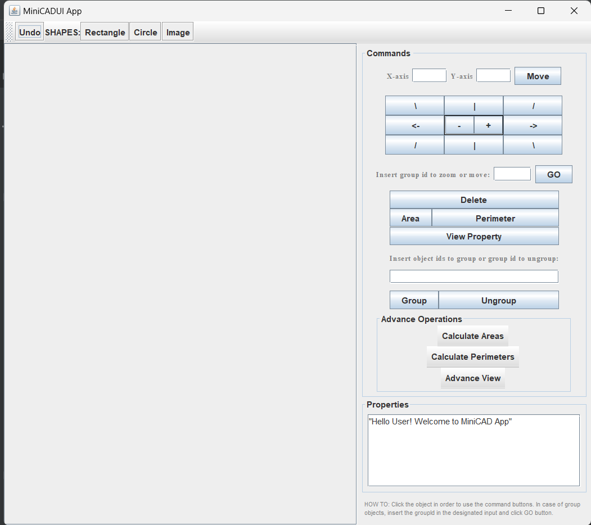

# MiniCAD
MiniCAD è un'applicazione che consente la creazione, manipolazione e gestione di oggetti grafici bidimensionali. Questo progetto include un interprete di comandi che permette di interagire con l'applicazione tramite comandi testuali.

----------------------------------------------------------------------------
## TABLE OF CONTENTS
- [Servizi](#servizi)
- [MiniCAD UI](#minicad-ui)
- [MiniCAD CLI](#minicad-cli)
- [Requisiti](#requisiti)
- [Architettura](#architetttura)
- [Grammatica](#grammatica)
- [Design Pattern Utilizzati](#design-pattern-utilizzati)
- [Struttura del Codice](#struttura-del-codice)
- [Testing](#testing)

-------------------------------------------------------------------------------------
## Servizi
1. Creazione 
2. Rimozione 
3. Spostamento 
4. Ridimensionamento
5. Visualizzazione delle proprietà
6. Creazione di gruppi di oggetti
7. Rimozione di gruppi di oggetti
8. Calcolo di area e perimetro

## MiniCAD UI
L'interfaccia utente permette agli utenti di interagire con il sistema MiniCAD tramite pulsanti e una visualizzazione grafica degli oggetti.

### Utilizzo MiniCAD UI
1. Far avviare la classe _MiniCAD/ui/MiniCADUI.java_.
2. All'avvio dell'applicazione, verrà visualizzataa una finestra con una toolbar, un'area di disegno e il panello per i comandi.
3. Utilizza i pulsanti sulla toolbar per crrare nuovi oggetti grafici.
4. Clicca sugli oggetti nell'area di disegno per selezionarli e poter utilizzare i pulsanti di comandi.
5. Per i group object, bisogna inserire l'id del gruppo nel textfield per i gruppi e clicca il pulsante GO.
6. Usa il pulsante "Undo" sulla toolbar per annullare l'ultima operazione.


## MiniCAD CLI
L'interfaccia a riga di comando permette agli utenti di interagire con il sistema MiniCAD tramite comandi testuali.

### Utilizzo MiniCAD UI
1. Avviare la classe _MiniCAD/ui/MiniCadCLI.java_.
2. Esempi di comandi da inserire:
    ```
   create circle (5.0) (3.1, 4.5)
   create rectangle (3.0, 2.0) (3.1, 4.5)
   create img ("./pippo.png") (6.1, 4.6)
   del id3
   mv id0 (5.9, 8.2)
   mvoff id0 (5.9, 8.2)
   scale id1 2.0
   ls id1
   ls circle
   ls all
   ls groups
   grp id0, id1
   ungrp id2
   area id0
   perimeter rectangle
   area all

    ```
3. Inserire _undo_ per fare l'annullamnento dell'ultima operazione.
4. Scrivi _exit_ per uscire.


## Requisiti
- JAVA21
- Librerie esterne : nessuna


## Architetttura
### Grammatica
```
<cmd> ::= <create> | <remove> | <move> | <scale> | <list> | <group> | <ungroup> | <area> | <perimeter>
<create> ::= new <typeconstr> <pos>
<remove> ::= del <objID>
<move> ::= mv <objID> <pos> | mvoff <objID> <pos>
<scale> ::= scale <objID> <posfloat>
<list> ::= ls <objID> | ls <type> | ls all | ls groups
<group> ::= grp <listID>
<ungroup> ::= ungrp <objID>
<area> ::= area <objID> | area <type> | area all
<perimeter> ::= perimeter <objID> | perimeter <type> | perimeter all
<pos> ::= ( <posfloat> <posfloat> )
<typeconstr> ::= circle (<posfloat>) | rectangle <pos> | img (<path>)
<type> ::= circle | rectangle | img
<listID> ::= <objID> { <objID> }
```

### Design Pattern Utilizzati
* Interpreter - Analizza e interpreta i comandi di creazione degli oggetti grafici 
* Composite - Utilizzato per la creazione e gestione dei group object. 

Design Pattern utilizzati nell'applicazione dove viene integrato il sistema:
* Observer -Per permettere agli oggetti di osservare e reagire agli eventi.
* Command - Per incapsulare richieste come oggetti, consentendo di parametrizzare gli oggetti con operazioni.
* Flyweight -  Per minimizzare l'uso della memoria condividendo quanti più dati possibili con oggetti simili
* Memento - per implementare l'_Undo_

### Struttura del Codice
* **MiniCAD/ui/MiniCADUI.java** - contiene la classe principale MiniCADUI che avvia l'applicazione e gestisce l'interfaccia utente.
* **MiniCAD/shapes/interpreter/commands** - contiene i comandi implementati con Interpreter Pattern.
* **MiniCAD/shapes/interpreter/lexerparser** - contiene le classi Lexer e Parser 
* **MiniCAD/shapes/interpreter/GroupObject.java** - classe per gestire i gruppi
* **MiniCAD/shapes/interpreter/Context.java** - classe context
* **MiniCAD/shapes/controllers/MiniCADController.java** - controller che gestiscono l'interazione tra l'interfaccia utente e il modello.
* **MiniCAD/shapes/view/CreateObjectActionMiniCad.java** - utilizzata per creare e gestire l'azione di creazione di oggetti grafici nell'applicazione MiniCAD

## Testing
Il progetto utilizza JUnit per il testing. 